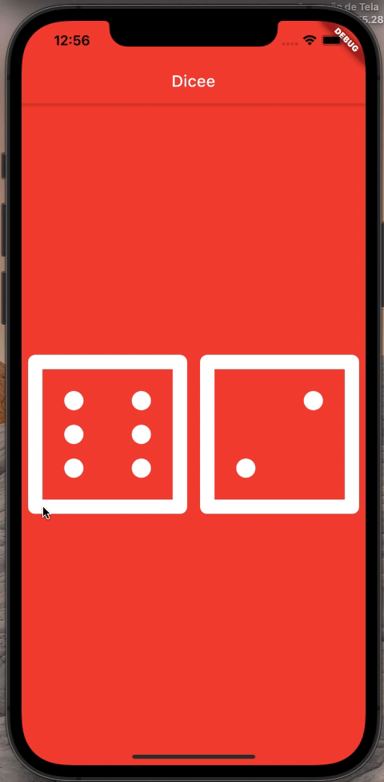

# Dicee

## Goal
To build an app that roll two dices as simple as possible.

## The App
A dice roller.

## Features
- Stateless widgets designing the user interface;
- Stateful widgets updating the user interface;
- onClick Listeners;
- setState marking the widget tree as dirty and requiring update on the next render;
- String interpolation;
- Code and use gesture controls.
